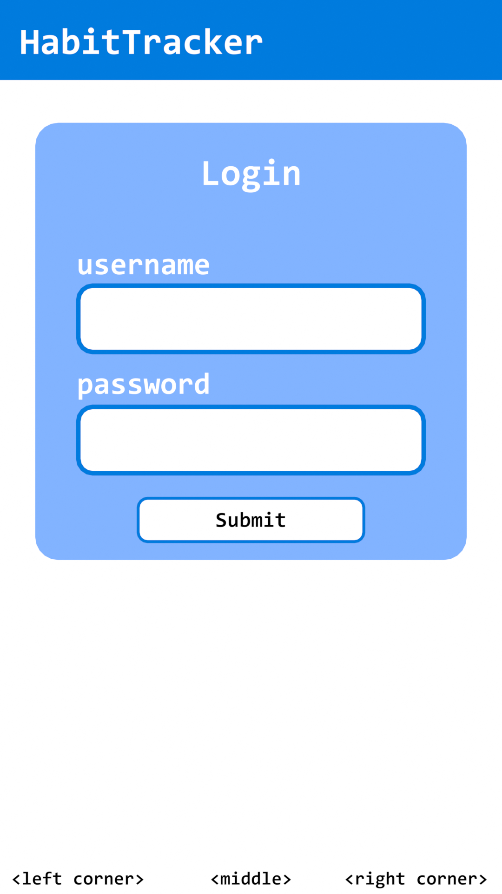
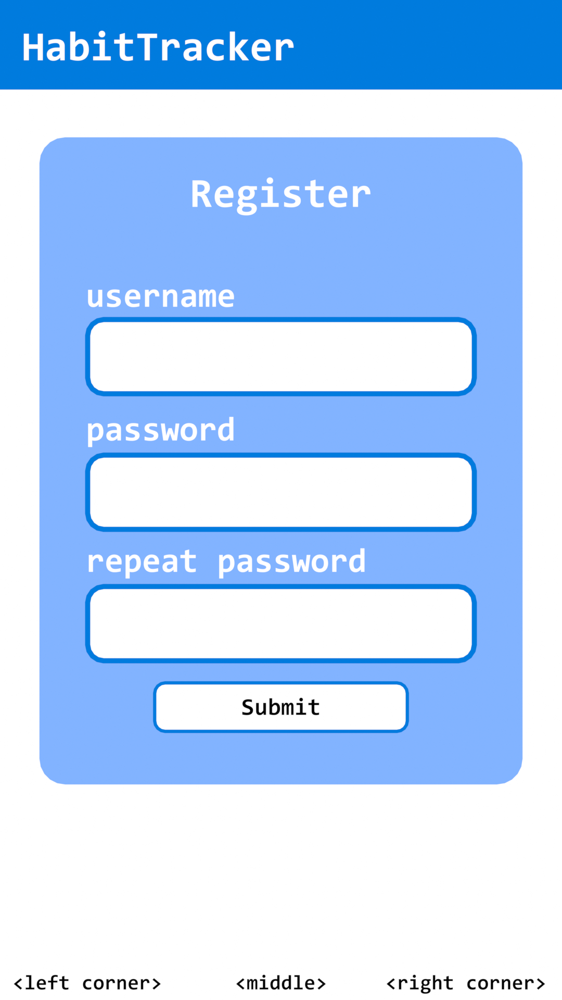
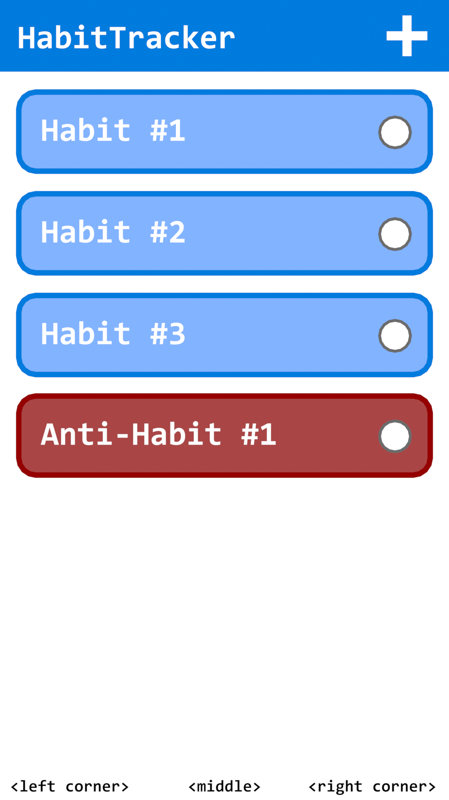
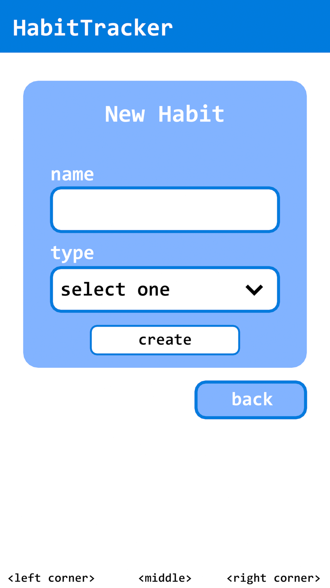
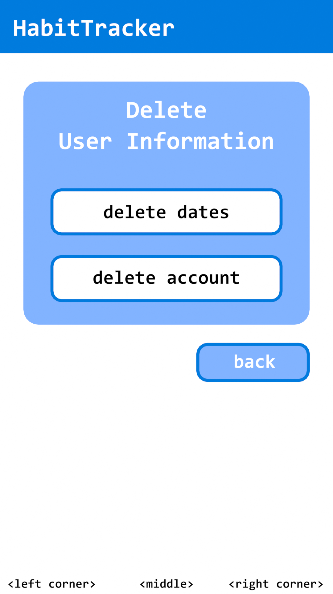

# Funkcionális Specifikáció

## 1. Áttekintés 
A projekt célja egy szokáskövető webalkalmazás fejlesztése, amely segíti a felhasználókat pozitív szokásaik kialakításában és fenntartásában, illetve a negatív szokások elhagyásában. Az alkalmazás reszponzív webfelületet biztosít, ahol a felhasználók saját szokásaikat rögzíthetik, követhetik és kiértékelhetik. Az adatok egy adatbázisban kerülnek tárolásra, amellyel a frontend kommunikál.

## 2. Jelenlegi helyzet
A megrendelő, egy bármilyen eszközről könnyen elérhető szokás követő (Habit Tracker) webalkalmazást szeretne. Ezt az alkalmazást az ügyfeleinek ajánjlaná, hogy jobbá tegye életüket. A XXI. század megköveteli, hogy mindez hálózaton is elérhető legyen

## 3. Követlemény lista
| ID | Név | Verzió | Leírás |
|----------|----------|----------|----------|
| 01    | Index weboldal   | 1.0   | Itt tudnak a felhasználók bejelentkezni.   |
| 02    | Regisztráció weboldal   | 1.0   | Itt tudnak a felhasználók fiókot regisztrálni.   |
| 03    | Mainpage weboldal   | 1.0   | Itt találhatóak a felhasználó által hozzáadott szokások.   |
| 04    | Newhabit weboldal   | 1.0   | Itt tudnak a felhasználók új szokást hozzáadni a fiókjukhoz.   |
| 05    | Viewhabit weboldal   | 1.0   | Itt tudják a felhasználók a már hozzáadott szokásukat részletesebben megtekinteni.   |
| 06    | Datadelete weboldal   | 1.0   | Itt tudják a felhasználók az elmentett adataikat törölni.   |
| 07    | Adatbázis   | 1.0   | A felhasználói adatok, szokások és beállítások biztonságos tárolását végzi.   |
| 08    | Backend   | 1.0   | Feldolgozza a felhasználói kéréseket, kapcsolatot tart az adatbázissal.   |

## 4. Igényelt üzleti folyamatok modellje

## 5. Használati esetek
Bejelentkezés
- A felhasználó megadja az email-címét és jelszavát, az alkalmazás ellenőrzi az adatbázisban, és belépteti.

Regisztráció
- A felhasználó megadja az adatait, az alkalmazás új fiókot hoz létre.

Új szokás hozzáadása
- A felhasználó megadja az új szokás nevét és típusát. Az alkalmazás eltárolja az adatbázisban.

Szokás megtekintése
- A felhasználó részletes statisztikát lát a szokásairól (pl. hány nap teljesült egymás után -> streak).

Szokás törlése
- A felhasználó törli a szokását, az alkalmazás frissíti az adatbázist.

## 6. Képernyő tervek

  
  
  

  
  

## 7. Forgatókönyv
**Új szokás felvétele és követése**

- A felhasználó megnyitja az alkalmazást, és bejelentkezik a fiókjába.
- A főoldalon kiválasztja a "+" gombot a jobb felső sarokban.
- Megadja a szokás nevét ("Futás"), típusát (pozitív), és menti.
- A rendszer eltárolja a szokást az adatbázisban, és megjeleníti a főoldalon.
- Másnap a felhasználó teljesíti a szokást, és az alkalmazásban kipipálja.
- A rendszer rögzíti a teljesítést, frissíti a statisztikát és jelzi, hogy 1 napos streak indult.
- A felhasználó a szokásra nyomva visszanézi a teljesítési arányát és motivációt kap.

